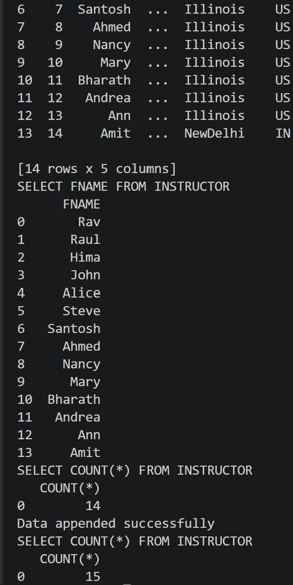

# Accessing Databases

This project demonstrates database access and manipulation using Python. It connects to a database and performs various SQL queries on an INSTRUCTOR table.

## Overview

The script (`accessing_databases.py`) performs the following operations:
- Retrieves instructor records from the database
- Executes SELECT queries to fetch instructor names and information
- Demonstrates data insertion and counting operations
- Shows successful data append operations

## Features

- Connect to relational database
- Execute SQL SELECT queries
- Retrieve and display query results
- Insert data and verify counts
- Handle database transactions

## Sample Output

Below is an example of the script's execution output showing query results:

The output shows:
- Instructor records with names and locations (Illinois, India)
- List of instructor first names from the database
- Record count verification (14 → 15 rows after insertion)
- Confirmation message for successful data append operations

## Files

- `accessing_databases.py` - Main Python script for database operations
- `INSTRUCTOR.csv` - Sample instructor data
- `README.md` - This file